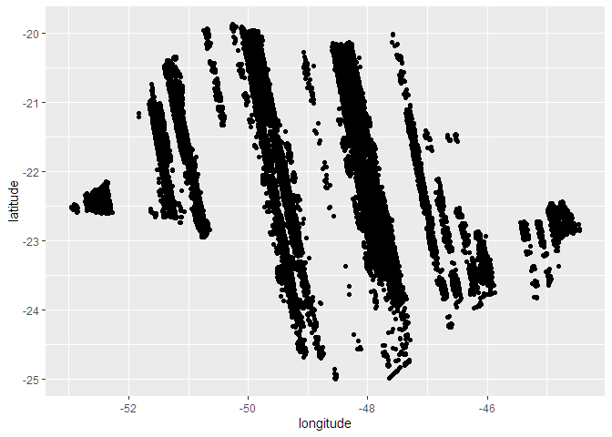
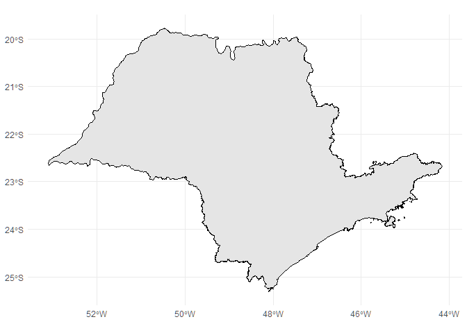
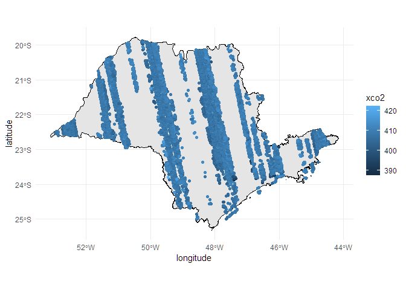

<!-- README.md is generated from README.Rmd. Please edit that file -->

# DERIVADA TEMPORAL DE XCO₂ PARA IDENTIFICAÇÃO FONTES E SUMIDOUROS DE CARBONO ATMOSFÉRICO NO ESTADO DE SÃO PAULO

Maria Laura Fraque Ferreira, Luis Miguel da Costa, Alan Rodrigo Panosso

**RESUMO** As mudanças climáticas e suas consequências impuseram
diversos desafios na atualidade, sendo a principal causa a emissão de
gases de efeito estufa (GEE) para a atmosfera, especialmente o dióxido
de carbono (CO₂). Embora as emissões globais estejam majoritariamente
relacionadas à queima de combustíveis fósseis, no Brasil, as mudanças no
uso e cobertura da terra (LULCC, na sigla em inglês) são a principal
causa das emissões de CO₂. Essas mudanças estão historicamente
associadas à expansão agrícola e ao desmatamento (Souza et al., 2020),
com as emissões brasileiras de GEE variando entre 0,4 e 1,7 Gt CO₂ eq em
2022. No Brasil, estudos mostraram correlação negativa entre SIF e a
concentração atmosférica de CO2. No entanto, poucas tentativas foram
feitas para esclarecer os principais sumidouros de CO2 e a SIF, bem como
aspectos relacionados como mudanças no uso e cobertura da terra (LULCC),
especialmente considerando os diferentes biomas brasileiros. A hipótese
da proposta se baseia na ideia de que fontes e sumidouros de CO2 podem
ser identificados por meio da análise de regressão linear simples, e
que, com a primeira derivada no tempo (β), é possível classificar pontos
específicos como fonte (β \> 0) ou sumidouro (β \< 0). Assim, os
objetivos deste trabalho serão identificar potenciais fontes e
sumidouros de CO2 e suas possíveis causas (por exemplo a SIF,
desmatamento e focos de incêndio), e estimar rapidamente os fluxos de
CO2 no estado de São Paulo a partir de observações via satélite.

## Carregar os pacotes

``` r
library(tidyverse)
library(geobr)
```

## Leitura de dados

Nessa parte estamos lendo os dados proveniente do trabalho previamente
realizado por Quadro 2026
(<https://github.com/arpanosso/tcc-fernando-quadros>)

``` r
dados <- read_rds("data/nasa-xco2-sp.rds") |> 
  filter(year >= 2019)
glimpse(dados)
#> Rows: 72,598
#> Columns: 14
#> $ longitude         <dbl> -52.91444, -52.92016, -52.92609, -52.91319, -52.9300…
#> $ latitude          <dbl> -22.49881, -22.50841, -22.51799, -22.47058, -22.4993…
#> $ time              <dbl> 1546362799, 1546362799, 1546362799, 1546362799, 1546…
#> $ date              <date> 2019-01-01, 2019-01-01, 2019-01-01, 2019-01-01, 201…
#> $ year              <dbl> 2019, 2019, 2019, 2019, 2019, 2019, 2019, 2019, 2019…
#> $ month             <dbl> 1, 1, 1, 1, 1, 1, 1, 1, 1, 1, 1, 1, 1, 1, 1, 1, 1, 1…
#> $ day               <int> 1, 1, 1, 1, 1, 1, 1, 1, 3, 10, 10, 10, 10, 10, 10, 1…
#> $ xco2              <dbl> 406.2080, 407.9608, 403.2545, 404.7390, 406.6734, 40…
#> $ xco2_quality_flag <int> 0, 1, 1, 1, 1, 1, 1, 1, 1, 1, 1, 1, 0, 1, 1, 1, 0, 1…
#> $ xco2_incerteza    <dbl> 0.6812540, 0.4800707, 0.5756908, 0.3722289, 0.421822…
#> $ path              <chr> "oco2_LtCO2_190101_B11100Ar_230602204610s.nc4", "oco…
#> $ flag_br           <lgl> TRUE, TRUE, TRUE, TRUE, TRUE, TRUE, TRUE, TRUE, TRUE…
#> $ flag_nordeste     <lgl> FALSE, FALSE, FALSE, FALSE, FALSE, FALSE, FALSE, FAL…
#> $ flag_sp           <lgl> TRUE, TRUE, TRUE, TRUE, TRUE, TRUE, TRUE, TRUE, TRUE…
```

Vamos ver os anos da série temporal

``` r
dados |> 
  distinct(year)
#>   year
#> 1 2019
#> 2 2020
#> 3 2021
#> 4 2022
#> 5 2023
#> 6 2024
```

Gráfico dos pontos no ano de 2019

``` r
dados |> 
  filter(
    year == 2019
  ) |> 
  ggplot(aes(longitude, latitude)) +
  geom_point()
```

<!-- -->

Usando o geobr

1 - Carregando os shapes

``` r
estados_geobr <- read_state(showProgress = FALSE)
```

2 - Filtrando para o estado de SP

``` r
sp_geobr <- estados_geobr |> 
  filter(abbrev_state == "SP")
```

3 - Apresentar o Mapa do estado de sao paulo

``` r
sp_geobr |> 
 ggplot() +
     geom_sf(aes_string(), color="black",
              size=.05, show.legend = TRUE) +
  theme_minimal() 
```

<!-- -->

Unir o shape do geobr com os pontos

``` r
sp_geobr |> 
  ggplot() +
  geom_sf(aes_string(), color="black",
          size=.05, show.legend = TRUE) +
  geom_point(data = dados |> 
               filter(year == 2019), aes(longitude, latitude,
             color=xco2)) +
  theme_minimal() 
```

<!-- -->
